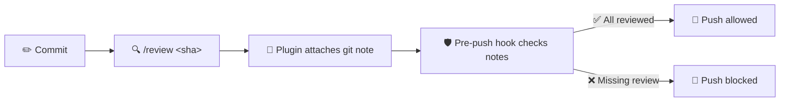

# opencode-review-enforcement

**Stop skipping code reviews!**

Enforced code review gate for OpenCode AI agents. Auto-attaches review notes to commits via git notes, blocks pushes of unreviewed commits.

No more "I'll review it later." No more "it's just a small change." Every commit gets reviewed, every push is gated.

## How It Works



1. **Commit** — Make your changes and commit
2. **Review** — Run `/review <sha>` in OpenCode TUI. Agents may also spawn a reviewer subagent using a target-only prompt (see agent-initiated section)
3. **Attach** — The plugin automatically attaches the review output as a git note to the commit
4. **Gate** — The pre-push hook checks every commit in the push range for a review note
5. **Push** — All reviewed → push allowed. Missing reviews → push blocked

## Install

### 1. Copy the files into your project

```bash
# Create the .opencode directory structure
mkdir -p .opencode/plugins .opencode/commands .opencode/agents

# Copy the plugin, command, and agent
cp plugin/review-note.ts .opencode/plugins/
cp command/review.md .opencode/commands/
cp agent/reviewer.md .opencode/agents/
```

### 2. Add the pre-push hook block

Append `hooks/pre-push-review-enforcement.sh` to your existing `.husky/pre-push`:

```bash
cat hooks/pre-push-review-enforcement.sh >> .husky/pre-push
```

Or source it from your pre-push hook:

```bash
source ./hooks/pre-push-review-enforcement.sh
```

### 3. Create a baseline

Create `.review-baseline` containing the SHA of the oldest commit that should be exempt from review enforcement. Commits at or before this SHA are skipped.

```bash
git rev-parse HEAD > .review-baseline
```

This marks all existing commits as exempt. Only **new** commits after this point will require review notes.

### 4. Restart OpenCode

The plugin is auto-discovered from `.opencode/plugins/`. Restart OpenCode to load it.

## Usage

### Manual review

Type `/review <sha>` in the OpenCode TUI. The plugin automatically attaches the review output as a git note.

Note: The visible reviewer task prompt is intentionally only `Input: <target>`. The full review methodology is in `agent/reviewer.md` as the reviewer subagent system prompt. Seeing only the input is expected and does not mean the methodology was omitted.

### Agent-initiated review

Spawn a reviewer subagent via the `task` tool. The reviewer agent has the full review methodology in its system prompt — just pass the SHA:

```
task(
  subagent_type: "reviewer",
  description: "review commit abc1234",
  prompt: "abc1234"
)
```

Only target-only prompts (SHA, PR ref, branch name) produce enforcement-grade notes. Reviewer subagent invocations with custom review methodology, focus areas, or output format instructions will still run but the plugin will **not** attach a review note.

The plugin validates the invocation as canonical before attaching the note — this is the enforcement boundary. Prompt hints to the model are defense-in-depth only.

### PR reviews

Pass a PR number with `#` prefix:

```
/review #742
```

The plugin resolves the PR's head commit via `gh pr view` and attaches the note to that commit.

## Configuration

### `.review-baseline`

A file containing a single commit SHA. Commits at or before this SHA are exempt from review enforcement. Update this when branching from a new point:

```bash
git rev-parse origin/main > .review-baseline
```

### Reviewer permissions

The reviewer subagent (`agent/reviewer.md`) has restricted permissions — read-only access to git and `gh`. Adjust the `bash` patterns in the frontmatter to match your workflow.

### Marker string

The plugin uses `Reviewed-by: opencode-review-subagent` as the marker in git notes. The pre-push hook checks for this exact string. Change it in both `plugin/review-note.ts` and `hooks/pre-push-review-enforcement.sh` if needed.

## Requirements

- **OpenCode** 1.17+ (plugin API v1)
- **Git** (for git notes and rev-parse)
- **gh CLI** (for PR reviews — optional, commit reviews work without it)

## How the Plugin Works

The plugin hooks into OpenCode's `tool.execute.after` event. When a task tool call completes, it first checks whether the invocation is canonical (enforcement-grade):

- `/review <target>` command → always canonical
- Reviewer subagent with a target-only prompt → canonical
- Reviewer subagent with custom methodology or instructions → **non-canonical** (runs but no note)

Canonical invocations resolve the target commit in this priority order:

1. **Explicit SHA** — Extracted from the task's `description`, `prompt`, or `command` fields (e.g., `"review commit abc1234"`). When both a SHA and PR number are present, the SHA wins because it identifies a specific commit, unlike a PR reference which resolves to the PR's mutable head.
2. **PR number** — Extracted from the same fields (e.g., `"#742"`). Resolved to the PR's `headRefOid` via `gh pr view`.
3. **HEAD** — Falls back to `git rev-parse HEAD` if neither SHA nor PR number is found.
4. **Attaches** the review output as a git note with the marker and review status.

## Files

| File | Purpose |
|------|---------|
| `plugin/review-note.ts` | OpenCode plugin that hooks `tool.execute.after` |
| `command/review.md` | `/review` command for manual TUI usage |
| `agent/reviewer.md` | Reviewer subagent with restricted permissions |
| `hooks/pre-push-review-enforcement.sh` | Pre-push hook block for enforcement |

## License

MIT
